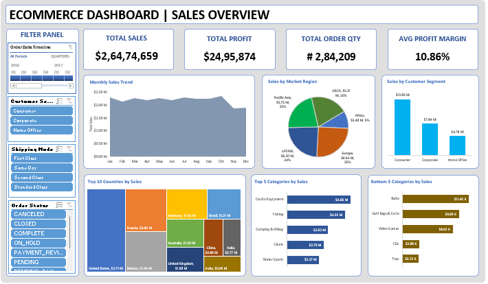

# 🛒 E-Commerce Sales Dashboard (Excel)

## 📌 Project Overview  
This project is an interactive Excel dashboard designed to analyze **e-commerce sales performance** across customer segments, product categories, regions, and time periods.  
It provides business teams with actionable insights using PivotTables, PivotCharts, Slicers, and KPI Cards.

---

## 🎯 Business Problem  
E-commerce businesses need insights to answer:

- Which regions generate the highest revenue?  
- Which product categories perform well or underperform?  
- Which customer segments drive the most profit?  
- How do monthly sales trends behave?  
- How do shipping modes & order statuses impact performance?  

This dashboard helps improve sales strategy, forecasting, and decision-making.

---

## 🛠 Tools & Techniques Used  
- Microsoft Excel  
- PivotTables  
- PivotCharts  
- Data Cleaning  
- Slicers (Filter Panel)  
- KPI Cards  
- Dashboard Formatting  

---

## 📊 Key KPIs  
- **Total Sales:** $26,474,659  
- **Total Profit:** $2,495,874  
- **Total Order Quantity:** 2,84,209  
- **Average Profit Margin:** 10.86%  

---

## 🔍 Business Insights  

### 1️⃣ Consumer Segment Drives Maximum Sales  
The **Consumer** segment generates the majority of revenue, making it the most important customer category.

### 2️⃣ USA, Europe & APAC Are Top-Performing Regions  
Most sales come from **North America**, followed by **Europe** and **APAC**, guiding targeted regional strategies.

### 3️⃣ Consistent Monthly Sales Trend  
Sales remain stable throughout the year with seasonal peaks—useful for forecasting and inventory planning.

### 4️⃣ Technology & Office Supplies Are Best-Selling Categories  
These categories deliver high sales volume, indicating strong market demand.

### 5️⃣ Baby, Clothing & Video Games Underperform  
Low-performing categories indicate low demand or require better marketing focus.

### 6️⃣ Premium Shipping Modes Increase Profitability  
First Class & Same Day orders contribute to higher profit margins, showing customer preference for fast delivery.

---

## 📈 Dashboard Preview  

<p align="center">
  
</p>

---

## 📂 Folder Structure  

```txt
Ecommerce-Sales-Overview/
│── Ecommerce Dashboard.xlsx
│── dashboard.png
└── README.md
---

## 📬 Contact  
**👤 Created by:** *Zishan Alam – Data Analyst (Excel | Power BI | SQL | Python)*  
**📧 Email:** zishanalam****@gmail.com  
**🔗 LinkedIn:** [linkedin.com/in/zishan-alam-/](https://www.linkedin.com/in/zishan-alam-/)
