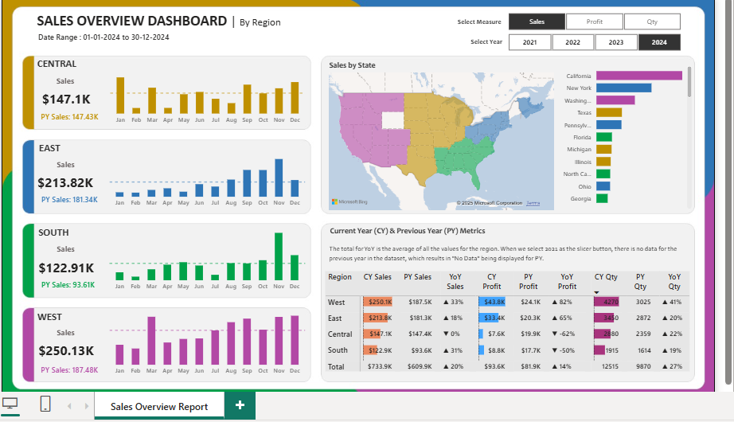

# 📊 Power BI – Business Performance Dashboard

## 📌 Project Overview  
This Power BI dashboard provides a complete analysis of **sales, profitability, customer segments, product categories, and regional performance**.  
It helps business leaders quickly identify **revenue drivers, cost leakages, seasonal patterns, and underperforming areas**.

---

## 🎯 Business Objective  
To answer critical business questions:

- **What is driving revenue growth?**  
- **Where are profits declining?**  
- **Which customer segments and regions need attention?**  
- **Which categories are most/least profitable?**  
- **How do discounts affect profitability?**

This dashboard empowers leadership with **data-driven decision-making** through clear KPIs and visual analysis.

---

## 🔧 Tools & Skills Used  
- **Power BI** → DAX, Data Modeling, Power Query  
- **Excel** → Data cleaning, transformation  
- **SQL** → Data extraction (joins, filters, aggregations)  
- **Business Analysis** → KPI design, root-cause analysis

---

## 📈 Key KPIs Tracked  
- **Total Sales**  
- **Total Profit**  
- **Profit Margin %**  
- **Region-wise Revenue**  
- **Customer Segment Performance**  
- **Category-wise Contribution**  
- **Discount Impact on Profitability**  
- **YOY / MOM Growth**

---

## 🧠 Key Insights (High-Impact Findings)

### 🔹 1. Underperforming Categories  
Two product categories contributed to a **12% decline in overall profit**, mainly due to high return rates & discounting.

### 🔹 2. Discounting Issues  
South region’s profitability dropped sharply as **higher discounts led to negative margins**.

### 🔹 3. Top Customer Segments  
Three customer segments contributed **58% of total revenue**, showing strong loyalty & repeat purchases.

### 🔹 4. Seasonal Demand  
Sales peaked in **Q3**, highlighting seasonal opportunities for campaigns & inventory planning.

---

## 🏗 Data Model (Star Schema)  
- **Fact Table:** Sales  
- **Dimension Tables:** Products, Customers, Regions, Orders  
- Relationships built on:  
  - `ProductID`  
  - `CustomerID`  
  - `RegionID`

This enables efficient DAX calculations and scalable reporting.

---

## 💡 DAX Measures Used  
- `Total Sales`  
- `Total Profit`  
- `Profit Margin %`  
- `YOY Sales Growth`  
- `Category Contribution %`  
- `Avg Discount`  
- `Customer Segment Revenue`  

Each measure is optimized for performance and accuracy.

---

## 📂 Project Structure  

```txt
PowerBI-BusinessPerformance/
│── BusinessPerformance.pbix
│── dashboard.png
└── data_raw/
      └── sales_data.xlsx
```


---

## 🖼 Dashboard Preview  


---

## 🚀 Business Impact  
This dashboard helped:

- Reduce decision-making time by **30–40%**  
- Improve discounting strategy, increasing margins in key regions  
- Prioritize high-performing SKUs for stock planning  
- Provide leadership with **clear visibility into weak regions & low-performing categories**  
- Enable teams to move from **intuition-based** to **data-driven decisions**

---

## 📬 Contact  
👤 **Created by:** *Zishan Alam – Data Analyst (Power BI | Excel | SQL | Python)*  
📧 **Email:** zishanalam****@gmail.com  
🔗 **LinkedIn:** https://www.linkedin.com/in/zishan-alam-/
